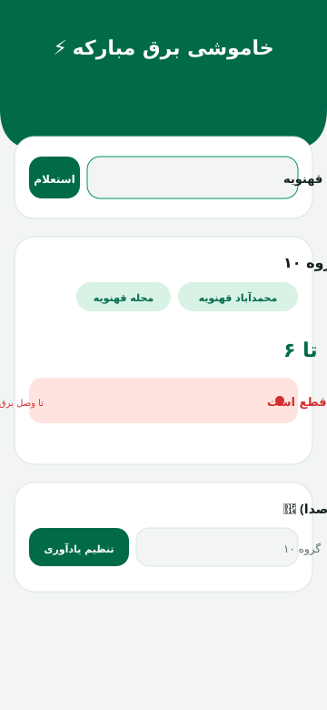

# ⚡ خاموشی برق مبارکه

**اپ اعلام زمان خاموشی‌های برنامه‌ریزی‌شدهٔ برق شهرستان مبارکه**
 
کاری از نیکان رایان قهنویه (نریمان)

[📥 دانلود مستقیم APK](https://github.com/9800/mobarakeh-outage/releases/latest/download/Khamooshi-Bargh-Mobarakeh.apk) • [📢 کانال رسمی برق مبارکه در ایتا](https://eitaa.com/epedcmobarake)

  
  
  

---

## ✨ امکانات

- 📋 **جدول روزانهٔ خاموشی** — دریافت خودکار از کانال رسمی ایتا (هر ۵ دقیقه + با هر بار ورود)
- 📍 **جستجوی آفلاین محله/خیابان/مکان** — ۲۵ گروه / ۲۵۷ نشانی طبق جدول رسمی اداره برق
- 🔴 **«الان برق کجا قطعه؟»** — نمایش زندهٔ مناطق در حال قطع با شمارش معکوس تا وصل
- 🔔 **یادآوری هوشمند** — نوتیفیکیشن + صدای اختصاصی + ویبره، N دقیقه قبل از قطع
- 🔒 **نمایش تمام‌صفحه روی صفحهٔ قفل** — دقیقاً مثل اذانِ بادصبا؛ تا نزدنِ «متوجه شدم» بسته نمی‌شود
- 🛡️ **ضد کشته‌شدن در شیائومی/سامسونگ** — سرویس پیش‌زمینه + معافیت باتری + راهنمای خودکار تنظیمات
- 📅 **تشخیص دقیق تاریخ جلالی** — امروز/فردا/روزهای قبل + انتخاب روز اعلامی
- 🌙 سازگار با حالت تاریک/روشن • 📴 کارکرد آفلاین با آخرین جدول دانلودشده
- 📱 سازگار با اندروید ۵ به بالا (همهٔ گوشی‌ها)

---

## 📥 نصب

1. روی لینک **دانلود مستقیم APK** در بالای صفحه بزنید
2. فایل را روی گوشی باز کنید و **Install** بزنید (در صورت پیام Play Protect: *Install anyway*)
3. بار اول، مجوزهای نوتیفیکیشن و باتری را **Allow** کنید

## 🔔 راهنمای یادآوری روی قفل (شیائومی)

هنگام نصب، خود برنامه صفحهٔ تنظیمات لازم را باز می‌کند؛ این دو را **Always allow** بزنید:
- Display pop-up windows while running in the background
- Autostart

## 🛠 توسعه‌ده
نیکان رایان قهنویه تابستان 1405 هجری شمسی
> ⚠️ این اپ غیررسمی است؛ دادهٔ خاموشی‌ها مستقیماً از کانال رسمی برق شهرستان مبارکه دریافت می‌شود.

**NikaNRaYaN** • نیکان رایان قهنویه (نریمان)

