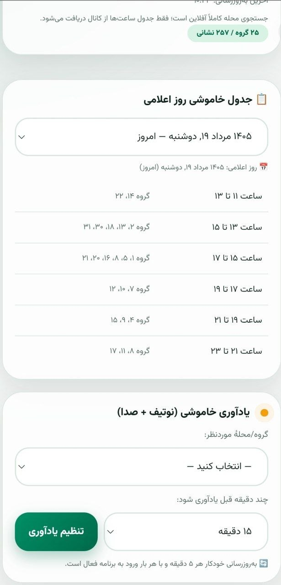
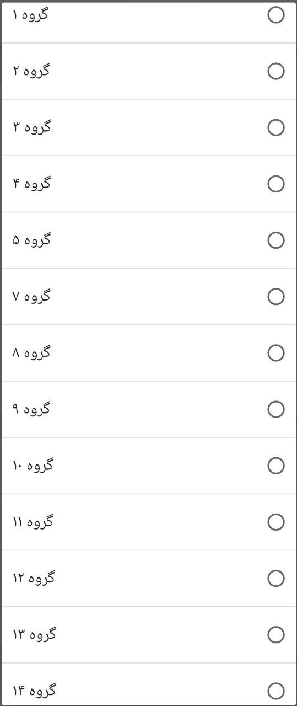
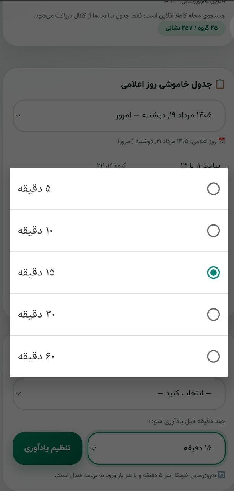
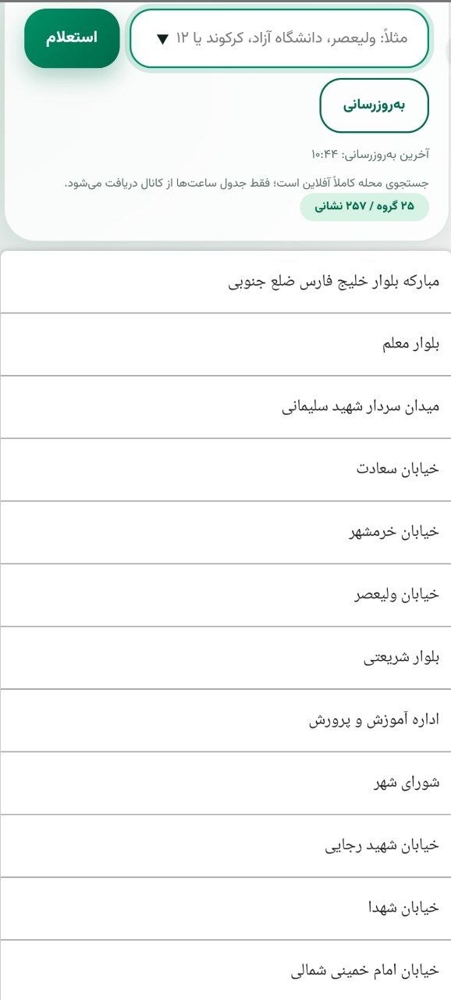
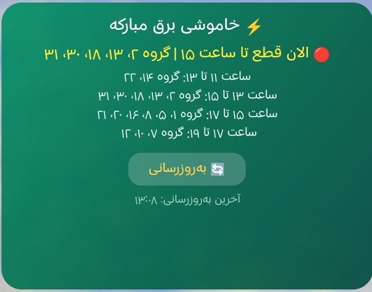

# ⚡ برنامه خاموشی برق مبارکه

اپلیکیشن اندرویدی مشاهده **زمان‌بندی قطع برق**، **اطلاعیه‌های خاموشی** و **گروه‌های خاموشی** شهرستان مبارکه — رایگان، سبک و همیشه در دسترس.

🌐 **وب‌سایت:** [9800.github.io/mobarakeh-outage](https://9800.github.io/mobarakeh-outage/)  
📣 **کانال ایتا:** [eitaa.com/epedcmobarake](https://eitaa.com/epedcmobarake/)

## 📥 دانلود

**[⬇ دانلود مستقیم آخرین نسخه (Khamooshi-Bargh-Mobarakeh.apk)](../../releases/latest/download/Khamooshi-Bargh-Mobarakeh.apk)**

یا از بخش [Releases](../../releases/latest) اقدام کنید.

## ✨ امکانات

- 🗺 نمایش گروه‌های خاموشی تمام مناطق شهرستان مبارکه
- 🔍 جست‌وجوی سریع خیابان، محله و منطقه
- 📢 اطلاعیه‌ها و اخبار خاموشی
- 🔔 یادآور زمان خاموشی
- 🌙 حالت تاریک و روشن
- 📦 حجم فوق‌العاده سبک و کاربری راحت
- 🛡 متن‌باز، امن و کاملاً رایگان

## 📱 تصاویر برنامه

  
  
  

  
  
  

## 🗂 گروه‌های خاموشی

فهرست کامل گروه‌های خاموشی شهرستان مبارکه هم داخل **وب‌سایت** (بخش جست‌وجو) و هم داخل خود اپلیکیشن قابل مشاهده است.

## 🌐 وب‌سایت (GitHub Pages)

این مخزن شامل وب‌سایت رسمی پروژه نیز هست که به‌صورت خودکار از برنچ `main` منتشر می‌شود:  
👉 [https://9800.github.io/mobarakeh-outage/](https://9800.github.io/mobarakeh-outage/)

## 🤝 مشارکت

این پروژه متن‌باز است؛ Issue و Pull Request همیشه باز است.

## ⚠️ سلب مسئولیت

این پروژه مستقل است و منبع رسمی اطلاعات، شرکت توزیع نیروی برق شهرستان مبارکه می‌باشد.
